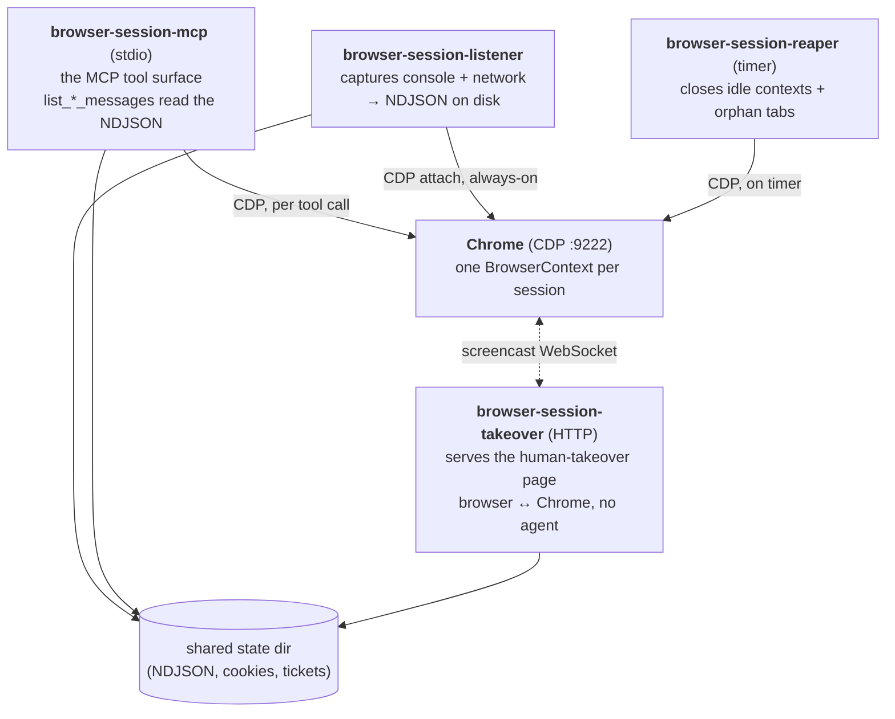

# browser-session-mcp

An MCP server that gives each AI agent its own **isolated, long-lived Chrome
browser session** — with full console + network capture, built-in anti-bot
stealth, and a "hand it to a human" flow for logins the agent must not see.

Sessions are addressed by an id you pass into every tool call, so they survive
MCP transport churn and even MCP-subprocess restarts. Written in Rust, driving
the Chrome DevTools Protocol via a lightly-forked
[`chromiumoxide`](https://github.com/xav-ie/chromiumoxide).

## Why you'd want it

- **Isolated sessions** — each agent gets its own cookies/storage/tabs; run many
  in parallel against one shared Chrome with zero cross-talk.
- **Survives restarts** — because a session is a tool argument (not a transport
  concept), it outlives transport reconnects and MCP-subprocess restarts (though
  *not* a Chrome restart — see [Operational notes](#operational-notes)).
- **Full capture** — every console message and network request is logged to disk
  losslessly, queryable per page-visit.
- **Anti-detection** — no `Runtime.enable` tell, coherent User-Agent +
  Client-Hints, `navigator.webdriver` masking, and trusted CDP input; toggle
  stealth per session.
- **Human takeover** — hand a live page to a person for password/passkey/2FA
  login without the agent ever seeing the credentials.
- **Saved cookie states** — log in once, reuse across future sessions.
- **[28 tools](#tool-surface-28-tools)** covering tabs, navigation, trusted
  input, screenshots, accessibility snapshots, and logs.

## Table of contents

- [Prerequisites](#prerequisites)
- [Quick start](#quick-start)
- [Tool surface (28 tools)](#tool-surface-28-tools)
- [Workflows](#workflows)
  - [Human takeover](#human-takeover)
  - [Saved cookie state](#saved-cookie-state)
- [How it works](#how-it-works)
  - [Sessions are a tool argument](#sessions-are-a-tool-argument)
  - [Architecture](#architecture)
  - [Anti-detection (stealth)](#anti-detection-stealth)
  - [Storage layout](#storage-layout)
- [Deployment](#deployment)
  - [Building from source (Nix)](#building-from-source-nix)
  - [Environment](#environment)
  - [Operational notes](#operational-notes)

## Prerequisites

- **A Chrome exposing the DevTools Protocol.** This server does not launch or
  bundle Chrome — you point it at a running one (e.g.
  `chrome-headless-shell --remote-debugging-port=9222`, or a remote Chrome behind
  a TLS proxy). Without it the server has nothing to drive.
- **Linux or macOS (x86_64 or aarch64)** for the prebuilt binaries. On other
  platforms, [build from source with Nix](#building-from-source-nix) (Linux only).
- **An MCP client** (Claude Code, or any MCP-capable agent host).

## Quick start

**1. Start a Chrome exposing CDP:**

```sh
chrome-headless-shell --remote-debugging-port=9222 &
```

**2. Grab a prebuilt binary.** Each tagged
[release](https://github.com/xav-ie/browser-session-mcp/releases) ships a tarball
per platform containing the single `browser-session` binary plus the built
takeover UI. Download, verify, extract:

```sh
ver=v0.1.0                                   # pick a release tag
arch=x86_64-unknown-linux-gnu                # aarch64-unknown-linux-gnu,
                                             # aarch64-apple-darwin, x86_64-apple-darwin
base=https://github.com/xav-ie/browser-session-mcp/releases/download/$ver
curl -fsSLO "$base/browser-session-$ver-$arch.tar.gz"
# verify (macOS: swap `sha256sum -c` for `shasum -a 256 -c`)
curl -fsSL "$base/SHA256SUMS" | grep "browser-session-$ver-$arch.tar.gz" | sha256sum -c -
tar -xzf "browser-session-$ver-$arch.tar.gz"
cd "browser-session-$ver-$arch"              # → the browser-session binary + webroot/
```

`browser-session` is a multi-call binary; its first argument picks the role
(`mcp` | `listener` | `reaper` | `takeover`). The MCP server is the `mcp` role.

**3. Wire it into your MCP client** by absolute path — e.g. Claude Code:

```sh
claude mcp add browser-session -e BROWSER_URL=http://localhost:9222 \
  -- /abs/path/to/browser-session mcp
```

(To run it directly instead: `BROWSER_URL=http://localhost:9222 ./browser-session mcp`.)

**4. Your first tool calls** — open a session, navigate, screenshot:

```ts
const { sessionId } = (
  await tools.browser_session_mcp.open_browser_session({})
).structuredContent;

await tools.browser_session_mcp.navigate({ sessionId, url: "https://example.com" });
await tools.browser_session_mcp.take_screenshot({ sessionId });
```

That's the whole loop. For login flows and cookie reuse, see
[Workflows](#workflows). For the full stealth/capture story, see
[How it works](#how-it-works).

> For lossless console/network capture and idle cleanup, also run the
> `listener` and `reaper` roles as daemons — see [Deployment](#deployment). The
> `mcp` role works standalone without them; you just won't get the
> `list_console_messages` / `list_network_requests` logs.

## Tool surface (28 tools)

Every tool except the lifecycle/listing ones and `await_human_takeover` takes
`sessionId` as its first argument.

**Session lifecycle**
- `open_browser_session({ viewport?, useMobileUA? })` → `{ sessionId, pageCount, activeUrl }`
- `close_browser_session({ sessionId })` — idempotent
- `list_browser_sessions()`

**Tabs**
- `new_page({ sessionId, url? })` — opens a tab; subsequent calls target it
- `list_pages({ sessionId })` — stable order, active tab marked `*`
- `switch_tab({ sessionId, tabIndex })` — make a tab active + bring to front
- `close_tab({ sessionId, tabIndex })`

**Navigation**
- `navigate({ sessionId, url, timeout? })` — resolves after the load event

**Capture**
- `take_screenshot({ sessionId, fullPage? })` — PNG as base64
- `take_snapshot({ sessionId })` — accessibility tree as indented text

**Interaction** (all via trusted CDP input)
- `click({ sessionId, selector | x,y, timeout? })`
- `type({ sessionId, selector, text, delay?, clear? })`
- `press_key({ sessionId, key, selector?, timeout? })` — `key` is a name (Enter, Tab, ArrowDown…) or a char
- `scroll({ sessionId, deltaY?, deltaX?, x?, y? })`
- `move_mouse({ sessionId, x, y })`
- `wait_for({ sessionId, selector? | text?, timeout? })`
- `evaluate({ sessionId, expression, tabIndex? })` — runs JS, returns the value

**Per-visit logs** (read from the listener's NDJSON)
- `list_visits({ sessionId })` — visit headers, oldest first
- `list_console_messages({ sessionId, visit?, limit? })` — `limit` default 500
- `list_network_requests({ sessionId, visit?, limit? })` — `limit` default 500

**Stealth**
- `set_stealth({ sessionId, enabled })`
- `get_stealth({ sessionId })` → `{ stealth }`

**Human takeover** (login/passkey without the agent seeing credentials)
- `request_human_takeover({ sessionId, ttl? })` → `{ url, token, expiresAtMs }` — non-blocking; mints a link
- `await_human_takeover({ token, timeout? })` → `{ completed }` — blocks until the human clicks Done

**Saved cookie states**
- `save_browser_state({ sessionId, name })`
- `load_browser_state({ sessionId, name })`
- `list_browser_states()`
- `delete_browser_state({ name })`

## Workflows

### Human takeover

When a flow needs credentials the agent must not handle (passwords, passkeys),
hand the live page to a human instead of automating the login:

```ts
const sid = (await tools.browser_session_mcp.open_browser_session({}))
  .structuredContent.sessionId;
await tools.browser_session_mcp.navigate({
  sessionId: sid,
  url: "https://accounts.google.com",
});

// Mint a link and SHOW IT TO THE USER (this call returns immediately).
const { url, token } = (
  await tools.browser_session_mcp.request_human_takeover({ sessionId: sid })
).structuredContent;
// → present `url`; the user opens it, sees a live view of the page, logs in
//   themselves (passkey/password/2FA), and clicks "Done".

// Wait for them to finish — IN A BACKGROUND TASK, polling with a short timeout.
// One long await can exceed the MCP client's request timeout (and you'd miss
// the Done signal); the human may take minutes. Poll until completed:
let done = false;
while (!done) {
  done = (
    await tools.browser_session_mcp.await_human_takeover({ token, timeout: 4000 })
  ).structuredContent.completed;
}
// Now authenticated — continue (and optionally save_browser_state to reuse it).
await tools.browser_session_mcp.navigate({
  sessionId: sid,
  url: "https://tagmanager.google.com",
});
```

How it works: `request_human_takeover` writes a ticket (sessionId + the active
page's CDP targetId) under `${TAKEOVER_DIR}/tokens/<token>.json` and returns
`${TAKEOVER_BASE_URL}/takeover/<token>`. The `browser-session-takeover` daemon
serves the page; its JavaScript opens a WebSocket straight to `${CHROME_WS_BASE}`
(the DevTools endpoint), runs `Page.startScreencast`, renders frames to a
canvas, and forwards the human's mouse/keyboard as `Input.dispatch*`. So
credentials go page→Chrome directly and never touch the agent or this daemon.
"Done" POSTs back, dropping `${TAKEOVER_DIR}/done/<token>`, which unblocks
`await_human_takeover`.

Security: the URL is a bearer credential (default TTL 5 min, max 30). The first
browser to open it *claims* it via an `HttpOnly` cookie — a leaked URL is
useless once the real user has it, and only the claimant can click Done.

### Saved cookie state

For sites where you don't want to log in every session:

```ts
// Once: log in (interactively or via takeover), then save the cookies
await tools.browser_session_mcp.save_browser_state({ sessionId: sid, name: "github" });

// Later, in any new session:
const sid2 = (await tools.browser_session_mcp.open_browser_session({}))
  .structuredContent.sessionId;
await tools.browser_session_mcp.load_browser_state({ sessionId: sid2, name: "github" });
await tools.browser_session_mcp.navigate({ sessionId: sid2, url: "https://github.com/foo" });
// already logged in
```

Cookies are saved as JSON under `${STATES_DIR}/<name>.json` in plaintext (file
mode 0600, dir 0700). v1 is **cookies-only** — localStorage is not yet
supported, but the on-disk schema reserves an `origins[]` field for forward
compat.

## How it works

### Sessions are a tool argument

Most Chrome-over-MCP servers tie a "session" to the transport (an SSE session,
a WebSocket, a streamable-http id). Transports reconnect constantly, and when
they do the browser goes with them — you lose cookies, tabs, and any state the
agent was building.

This server inverts that: **the session is a tool argument.** An agent calls
`open_browser_session` once, gets back a `sessionId`, and passes that id into
every subsequent call. Under the hood `sessionId` *is* a Chrome
`BrowserContextId` — an incognito-style isolated profile (own cookies, storage,
tabs). The session lives as long as the Chrome process does. Reconnect the
transport, restart the MCP subprocess — the context is still there, found again
by id.

Contexts are cheap; one Chrome holds many. Two agents in parallel → two
sessions → two contexts → zero shared state.

### Architecture

Four processes cooperate around one Chrome. Three are long-running daemons; the
MCP server itself is a stdio subprocess that can be killed and respawned freely.



All four roles are the one `browser-session` binary invoked with a different
first argument:

- **`browser-session mcp`** — the MCP server (stdio). Connects to Chrome
  lazily, hands out contexts, drives navigation/interaction, and reads the
  on-disk event logs back. Stateless beyond Chrome + the shared state dir, so
  mcp-proxy churn or cache eviction can restart it at will.
- **`browser-session listener`** — long-running CDP listener. The single source
  of truth for console + network capture: it attaches to every target and
  writes per-visit NDJSON. Decoupled from the MCP subprocess on purpose — run it
  with `Restart=always` so the capture gap during a crash is seconds.
- **`browser-session reaper`** — one-shot sweeper (run on a timer). Disposes
  contexts idle longer than `MAX_IDLE_HOURS` and closes orphan tabs that belong
  to no tracked session, then prunes the state file and stale logs.
- **`browser-session takeover`** — tiny HTTP daemon serving the human-takeover
  UI (a static [Astro app](frontend)). It never touches Chrome; the page's JS
  talks CDP straight to the browser. See [Human takeover](#human-takeover).

### Anti-detection (stealth)

This stack is meant to drive real sites without tripping bot gates, so it
removes the common headless/automation tells:

- **No `Runtime.enable`.** The [chromiumoxide fork](https://github.com/xav-ie/chromiumoxide) never sends
  `Runtime.enable` — the primary CDP automation tell systems like Cloudflare
  watch for. The MCP evaluates JS in an on-demand isolated world (or the main
  world, see below) instead.
- **User-Agent + Client Hints override.** Every target gets a coherent UA and
  matching `Sec-CH-UA-*` metadata so `HeadlessChrome` never leaks. Default is
  Chrome-on-Linux desktop; `useMobileUA: true` switches to Chrome-on-Android
  (Pixel 8). The version is read live from the real Chrome so hints stay
  consistent.
- **JS tell masking.** An init script (run before page scripts, on every tab)
  hides `navigator.webdriver`, installs a realistic PDF plugin set and
  `window.chrome.runtime`, etc. WebGL is deliberately *not* spoofed — Chrome
  renders on a real GPU, so the genuine renderer passes consistency checks a
  software-GL spoof would fail.
- **Loopback firewall.** `Network.setBlockedURLs` blocks in-page requests to
  `localhost`/`127.0.0.1`/`::1`/`0.0.0.0` on every target, so a page can't
  port-scan the DevTools port, the takeover daemon, or any other local service.
- **Trusted input.** `click`/`type`/`press_key`/`scroll`/`move_mouse` dispatch
  real CDP input events (not synthetic JS), which fire handlers reliably, grant
  user activation (can open popups), and produce human-like behavioral signals.

#### The stealth toggle

`set_stealth(enabled: true/false)` trades capture for invisibility per session:

| | console capture | `evaluate` runs in | CDP `Runtime.enable` tell |
|---|---|---|---|
| stealth **off** (default) | ✅ on | main world (reads `window.dataLayer`, `__NEXT_DATA__`, …) | present |
| stealth **on** | ❌ off | isolated world (DOM/navigator only) | absent |

Typical flow for a bot-gated page: `set_stealth(true)` → `navigate` past the
gate → `set_stealth(false)` → `evaluate` to read page globals.

### Storage layout

All daemons share one state dir (default `/var/lib/browser-session-mcp`),
typically a volume mounted into the MCP container and visible to the host
daemons — the processes coordinate purely through files in it.

```
/var/lib/browser-session-mcp/
├── state.json                        # session lastUsedAt — read by the reaper
├── logs/
│   └── <sessionId>/
│       ├── 00001-<targetId>.ndjson   # per-visit event log
│       └── ...
├── states/                           # saved cookies (dir 0700)
│   └── github.json                   #   each file 0600
└── takeover/                         # human-takeover IPC
    ├── tokens/<token>.json           # ticket: sessionId + targetId + expiry
    ├── claims/<token>                # first-claimant secret
    ├── done/<token>                  # "Done" sentinel
    └── stealth/<sessionId>           # presence = stealth on for that session
```

A **visit** is one top-level navigation in one tab — the boundary is CDP
`Page.frameNavigated` on the main frame. Each visit gets its own NDJSON file
whose first line is a `{"kind":"visit",seq,targetId,url,openedAt}` header,
followed by one line per console + network event. The document request that
triggered a visit fires *before* `frameNavigated`, so it's retroactively
reassigned to the new visit.

## Deployment

The [Quick start](#quick-start) covers the prebuilt-binary path. This section
covers building from source, the full env-var reference, and running the
supporting daemons in production.

### Building from source (Nix)

Build with Nix (produces the `browser-session` binary, wrapped so its `takeover`
role finds the bundled Astro UI):

```sh
nix build           # → ./result/bin/browser-session   (subcommands: mcp|listener|reaper|takeover)
nix develop         # dev shell with cargo, rustc, node/pnpm for the frontend
```

The MCP server talks MCP over stdio and expects a Chrome exposing the DevTools
Protocol at `BROWSER_URL` (e.g. `chrome-headless-shell --remote-debugging-port=9222`,
or `https://chrome.<domain>` behind a TLS proxy — TLS is supported):

```sh
BROWSER_URL=http://localhost:9222 browser-session mcp
```

Without the Nix wrapper, point the takeover daemon at the bundled `webroot/`
yourself:

```sh
TAKEOVER_WEBROOT=$PWD/webroot CHROME_WS_BASE=ws://localhost:9222 \
  ./browser-session takeover
```

### Environment

`browser-session mcp` (the MCP server):

| var | default | notes |
|---|---|---|
| `BROWSER_URL` | — (**required**) | DevTools HTTP(S) endpoint |
| `STATE_FILE` | `/var/lib/browser-session-mcp/state.json` | |
| `LOGS_DIR` | `/var/lib/browser-session-mcp/logs` | |
| `STATES_DIR` | `/var/lib/browser-session-mcp/states` | saved cookies |
| `TAKEOVER_DIR` | `/var/lib/browser-session-mcp/takeover` | takeover IPC |
| `TAKEOVER_BASE_URL` | — | public URL of the takeover daemon; without it `request_human_takeover` errors |

`browser-session listener` — `BROWSER_URL` (default `http://127.0.0.1:9222`),
`LOGS_DIR`, `TAKEOVER_DIR`. Run as a systemd service with `Restart=always`,
ordered `After=` Chrome.

`browser-session reaper` — `BROWSER_URL`, `STATE_FILE`, `LOGS_DIR`,
`MAX_IDLE_HOURS` (default 24). Run on a timer (e.g. every 12h).

`browser-session takeover` — `TAKEOVER_BIND` (default `127.0.0.1:9223`),
`TAKEOVER_DIR`, `CHROME_WS_BASE` (**required**, e.g. `wss://chrome.<domain>`),
`TAKEOVER_WEBROOT` (set automatically by the Nix wrapper). Run as a systemd
service.

### Operational notes

- The listener is the only source of console + network events. While it's down
  those events are lost; `Restart=always` keeps that window to seconds.
- Sessions survive transport churn and MCP-subprocess restarts, **but not a
  Chrome restart** — if Chrome restarts, all contexts are gone and agents must
  `open_browser_session` again.
- The reaper deletes a session's NDJSON folder when it closes the context, so
  log space stays bounded. Idle cutoff is `MAX_IDLE_HOURS`.
- There's no per-visit log rotation: a single very long-lived visit on a noisy
  SPA can grow its NDJSON file without bound. In practice this hasn't been a
  problem.
</content>
</invoke>
