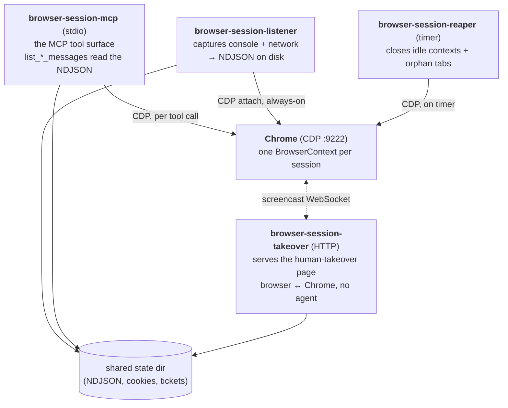

# How it works

_[← Back to README](../README.md) · [Docs index](README.md)_

- [Sessions are a tool argument](#sessions-are-a-tool-argument)
- [Architecture](#architecture)
- [Anti-detection (stealth)](#anti-detection-stealth)
- [Storage layout](#storage-layout)

## Sessions are a tool argument

Most Chrome-over-MCP servers tie a "session" to the transport (an SSE session,
a WebSocket, a streamable-http id). Transports reconnect constantly, and when
they do the browser goes with them — you lose cookies, tabs, and any state the
agent was building.

This server inverts that: **the session is a tool argument.** An agent calls
`open_browser_session` once, gets back a `sessionId`, and passes that id into
every subsequent call. Under the hood `sessionId` *is* a Chrome
`BrowserContextId` — an incognito-style isolated profile (own cookies, storage,
tabs). The session lives as long as the Chrome process does: reconnect the
transport or restart the MCP subprocess and the context is still there, found
again by id. (It does not survive a *Chrome* restart — see
[Operational notes](deployment.md#operational-notes).)

Contexts are cheap; one Chrome holds many. Two agents in parallel → two
sessions → two contexts → zero shared state.

## Architecture

Four processes cooperate around one Chrome. Three are long-running daemons; the
MCP server itself is a stdio subprocess that can be killed and respawned freely.



All four roles are the one `browser-session` binary invoked with a different
first argument:

- **`browser-session mcp`** — the MCP server (stdio). Connects to Chrome
  lazily, hands out contexts, drives navigation/interaction, and reads the
  on-disk event logs back. Stateless beyond Chrome + the shared state dir, so
  mcp-proxy churn or cache eviction can restart it at will.
- **`browser-session listener`** — long-running CDP listener. The single source
  of truth for console + network capture: it attaches to every target and
  writes per-visit NDJSON. Decoupled from the MCP subprocess on purpose — run it
  with `Restart=always` so the capture gap during a crash is seconds.
- **`browser-session reaper`** — one-shot sweeper (run on a timer). Disposes
  contexts idle longer than `MAX_IDLE_HOURS` and closes orphan tabs that belong
  to no tracked session, then prunes the state file and stale logs.
- **`browser-session takeover`** — tiny HTTP daemon serving the human-takeover
  UI (a static [Astro app](../frontend)). It never touches Chrome; the page's JS
  talks CDP straight to the browser. See [Human takeover](workflows.md#human-takeover).

## Anti-detection (stealth)

This stack is meant to drive real sites without tripping bot gates, so it
removes the common headless/automation tells:

- **No `Runtime.enable`.** The [chromiumoxide fork](https://github.com/xav-ie/chromiumoxide) never sends
  `Runtime.enable` — the primary CDP automation tell systems like Cloudflare
  watch for. The MCP evaluates JS in an on-demand isolated world (or the main
  world, see below) instead.
- **User-Agent + Client Hints override.** Every target gets a coherent UA and
  matching `Sec-CH-UA-*` metadata so `HeadlessChrome` never leaks. Default is
  Chrome-on-Linux desktop; `useMobileUA: true` switches to Chrome-on-Android
  (Pixel 8). The version is read live from the real Chrome so hints stay
  consistent.
- **JS tell masking.** An init script (run before page scripts, on every tab)
  hides `navigator.webdriver`, installs a realistic PDF plugin set and
  `window.chrome.runtime`, etc. WebGL is deliberately *not* spoofed — Chrome
  renders on a real GPU, so the genuine renderer passes consistency checks a
  software-GL spoof would fail.
- **Loopback firewall.** `Network.setBlockedURLs` blocks in-page requests to
  `localhost`/`127.0.0.1`/`::1`/`0.0.0.0` on every target, so a page can't
  port-scan the DevTools port, the takeover daemon, or any other local service.
- **Trusted input.** `click`/`type`/`press_key`/`scroll`/`move_mouse` dispatch
  real CDP input events (not synthetic JS), which fire handlers reliably, grant
  user activation (can open popups), and produce human-like behavioral signals.

### The stealth toggle

`set_stealth(enabled: true/false)` trades capture for invisibility per session:

| | console capture | `evaluate` runs in | CDP `Runtime.enable` tell |
|---|---|---|---|
| stealth **off** (default) | ✅ on | main world (reads `window.dataLayer`, `__NEXT_DATA__`, …) | present |
| stealth **on** | ❌ off | isolated world (DOM/navigator only) | absent |

Typical flow for a bot-gated page: `set_stealth(true)` → `navigate` past the
gate → `set_stealth(false)` → `evaluate` to read page globals.

## Storage layout

All daemons share one state dir (default `/var/lib/browser-session-mcp`),
typically a volume mounted into the MCP container and visible to the host
daemons — the processes coordinate purely through files in it.

```
/var/lib/browser-session-mcp/
├── state.json                        # session lastUsedAt — read by the reaper
├── logs/
│   └── <sessionId>/
│       ├── 00001-<targetId>.ndjson   # per-visit event log
│       └── ...
├── states/                           # saved cookies (dir 0700)
│   └── github.json                   #   each file 0600
└── takeover/                         # human-takeover IPC
    ├── tokens/<token>.json           # ticket: sessionId + targetId + expiry
    ├── claims/<token>                # first-claimant secret
    ├── done/<token>                  # "Done" sentinel
    └── stealth/<sessionId>           # presence = stealth on for that session
```

A **visit** is one top-level navigation in one tab — the boundary is CDP
`Page.frameNavigated` on the main frame. Each visit gets its own NDJSON
(newline-delimited JSON) file whose first line is a
`{"kind":"visit",seq,targetId,url,openedAt}` header, followed by one line per
console + network event. The document request that triggered a visit fires
*before* `frameNavigated`, so it's retroactively reassigned to the new visit.

---

**Next:** [Deployment](deployment.md) — run the daemons in production.
